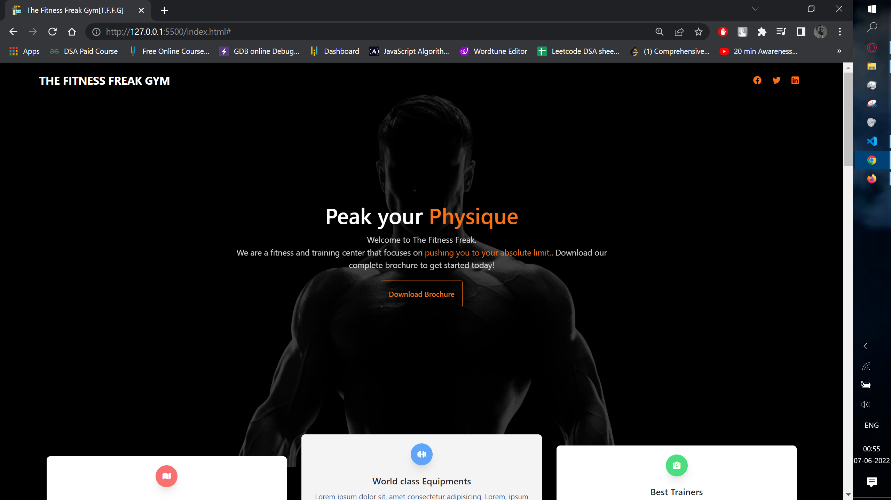
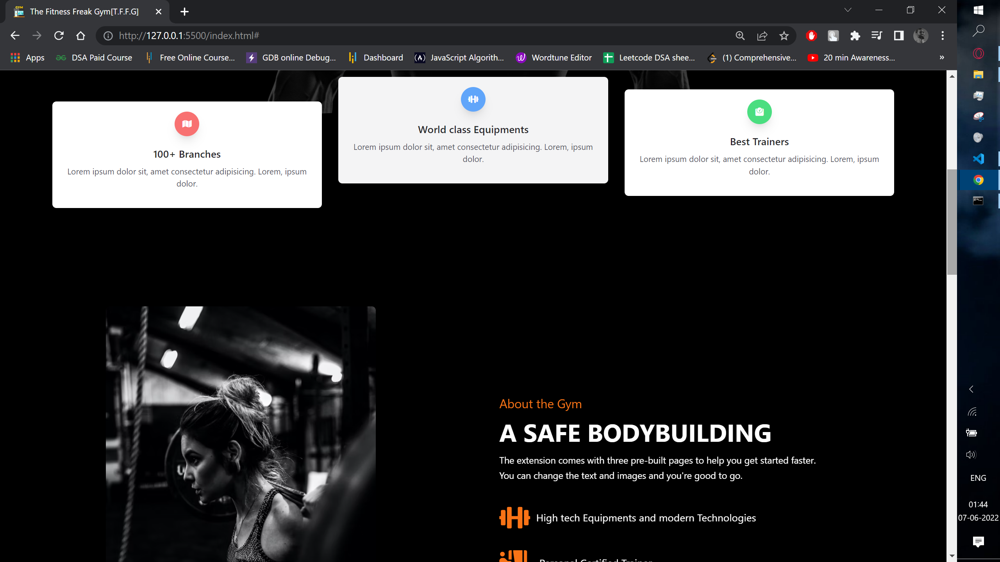
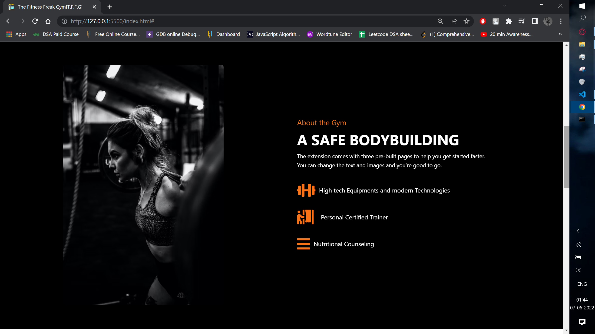
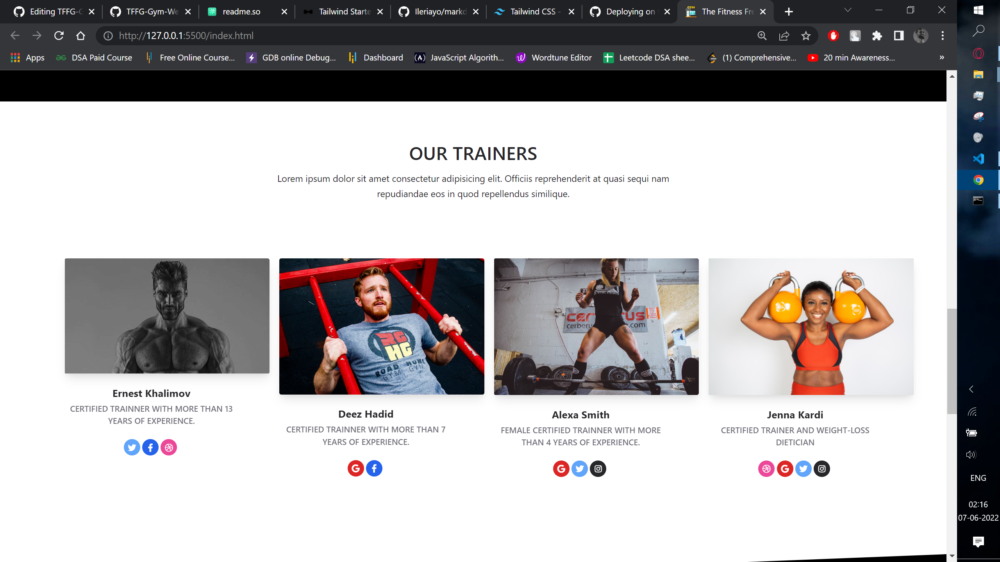
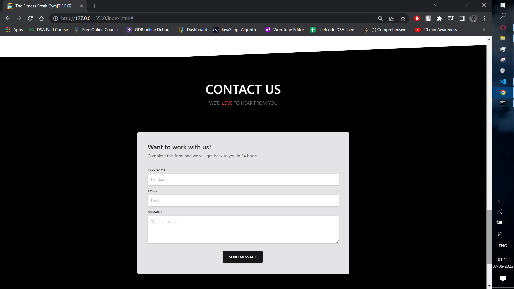
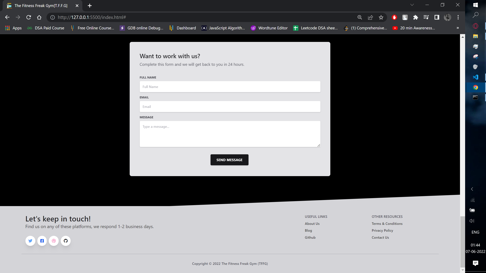
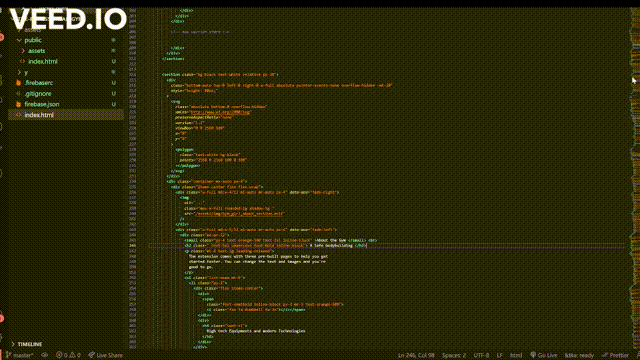

# The Fitness Freak Gym (TFFG) Website 


The TFFG website is a static website build with the help of HTML and
 tailwind css along with ONS.

## Badges


## Documentation

[tailwindcss](https://tailwindcss.com/)


## Run Locally

Clone the project

```bash
  git clone https://link-to-project
```

Go to the project directory

```bash
  cd my-project
```

Start the server on localhost (Directly)

```bash
  Open with live server on you local machine
```


## Screenshots








## Demo



## Appendix

Base template used: https://www.creative-tim.com/learning-lab/tailwind-starter-kit/presentation

## 🔗 Links
[](https://www.linkedin.com/in/yash-sonawane-ba848321b/)
[](https://twitter.com/)

## Support

If you like the work I do, show your appreciation by 'FORK', 'STAR' and 'SHARE'.

[](https://forthebadge.com)
